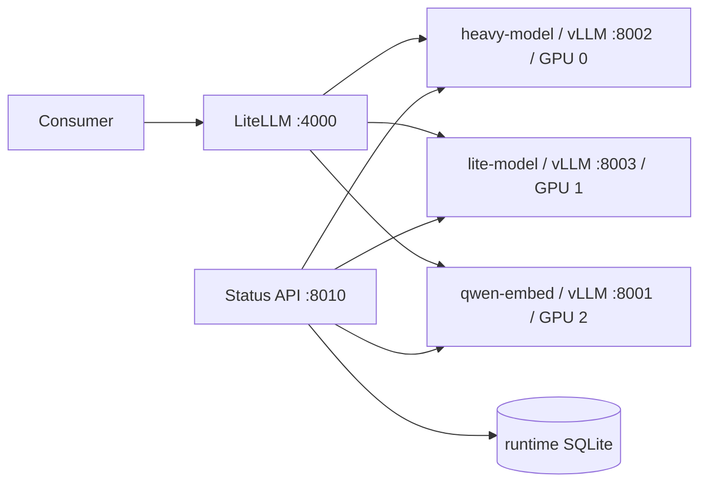

# Local LLM serving

This repository runs two chat models and one embedding model on a three-GPU Slurm allocation. vLLM serves each backend on loopback; LiteLLM is the only OpenAI-compatible gateway. The status API polls backend health and metrics and stores one day of compact samples in SQLite.



Heavy (`heavy-model`) handles quality schema inference, evidence review, and answer verification. Lite (`lite-model`) handles structured and EDC extraction, mapping, planning, and MCP control. Embed (`qwen-embed`) accepts embedding requests only.

## Quick start in a Slurm allocation

```sh
srun --gres=gpu:ampere:3 --cpus-per-task=16 --mem=64g --time=48:00:00 --pty bash -l
cd /mnt/ceph/storage/data-tmp/current/xepi3167/thesis/final-final-llm-setup
cp .env.example .env
# Set LITELLM_MASTER_KEY and configure Hugging Face credentials if needed.
set -a; source .env; set +a
mkdir -p "$LLM_SETUP_LOCAL_ROOT"
uv python install 3.13
uv sync --python 3.13 --extra serve
uv run llm-setup profile validate --profile profiles/a100-3x40.yaml
uv run llm-setup start --profile profiles/a100-3x40.yaml
```

The example environment puts the Python environment and package cache on node-local scratch to avoid slow imports from shared Ceph storage. The venv is temporary and must be recreated in a new allocation. The initial embedding ID is set in `profiles/a100-3x40.yaml` and can be overridden with `EMBED_MODEL_ID`. No model weights are downloaded by validation. See `docs/OPERATIONS.md` for exact lifecycle commands.
