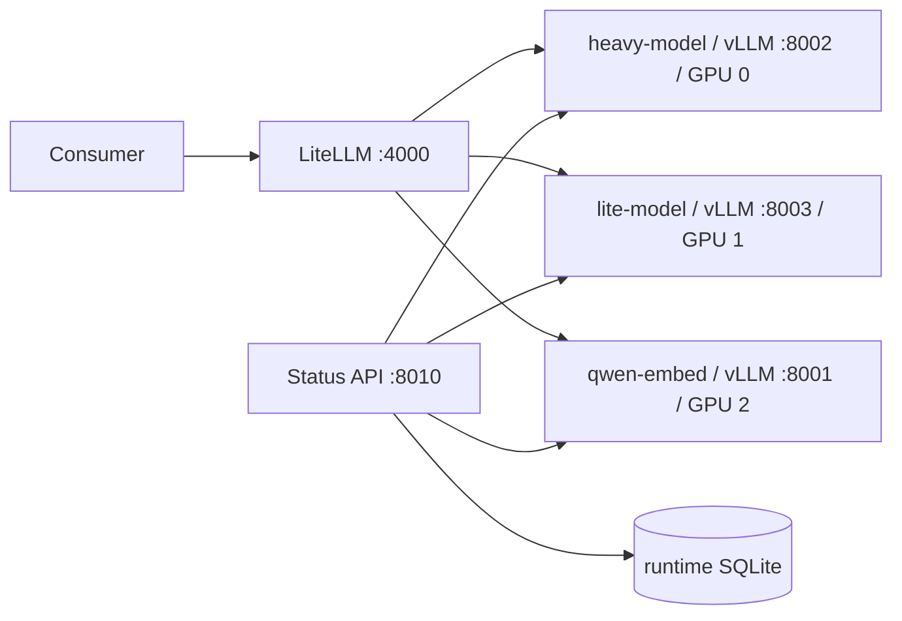

# Local LLM serving

This repository runs two chat models and one embedding model on a three-GPU Slurm allocation. vLLM serves each backend on loopback; LiteLLM is the only OpenAI-compatible gateway. The status API polls backend health and metrics and stores one day of compact samples in SQLite.


```mermaid
flowchart LR
  C[Consumer] --> L[LiteLLM :4000]
  L --> H[heavy-model / vLLM :8002 / GPU 0]
  L --> S[lite-model / vLLM :8003 / GPU 1]
  L --> E[qwen-embed / vLLM :8001 / GPU 2]
  A[Status API :8010] --> H
  A --> S
  A --> E
  A --> D[(runtime SQLite)]
```

Heavy (`heavy-model`) handles quality schema inference, evidence review, and answer verification. Lite (`lite-model`) handles structured and EDC extraction, mapping, planning, and MCP control. Embed (`qwen-embed`) accepts embedding requests only.

## Quick start: a Slurm batch job

The stack runs as a batch job, so it keeps running when your terminal or SSH connection closes, restarts a
service that crashes, and stops cleanly at `scancel` or three minutes before the time limit.

```sh
cd /mnt/ceph/storage/data-tmp/current/xepi3167/thesis/final-final-llm-setup
cp .env.example .env                       # once: set LITELLM_MASTER_KEY (and Hugging Face credentials)
sbatch slurm/llm-stack.sbatch              # prints the job id
tail -f runtime/slurm-<jobid>.out          # what it is doing: per-model phase every 15 s, then events
```

The log shows each model's phase while it loads (downloading, loading weights 63%, capturing CUDA graphs,
ready after 4:12), then a line for every exit, restart and stop, and a summary every five minutes. For a shell
on the same node (doctor, the harness, tunnels): `srun --jobid <jobid> --overlap --pty bash -l`, then
`set -a; source .env; set +a` and `uv run llm-setup doctor --profile profiles/a100-3x40.yaml`.
Stop with `scancel <jobid>`.

Interactively (inside `srun --pty`), the same: `uv run llm-setup start --profile profiles/a100-3x40.yaml
--foreground`; without `--foreground` the command returns once everything is ready and nothing watches
the services afterwards.

The example environment puts the Python environment and package cache on node-local scratch to avoid slow imports from shared Ceph storage. The venv is temporary and must be recreated in a new allocation. The initial embedding ID is set in `profiles/a100-3x40.yaml` and can be overridden with `EMBED_MODEL_ID`. No model weights are downloaded by validation. See `docs/OPERATIONS.md` for exact lifecycle commands.
